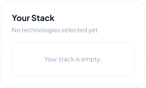
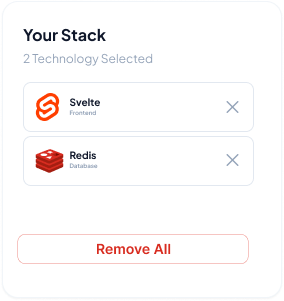

# Dev Stack

A responsive React + TypeScript + Vite + Tailwind CSS technology stack builder recreated from the supplied UI references.

### 🧭 Navbar
- Navbar designed according to the UI.
- Left: brand logo + "Dev Stack" name.
- Center: nav links — Home, Technologies, Projects, About, Contact.
- Right: "Sign In" (text button) and "Sign Up" (filled pill button).
- Navbar stays sticky at the top while scrolling.

---

### 🎯 Banner / Hero
- Banner section includes:
  - Heading (two-tone: plain text + gradient text)
  - Description text
  - Two buttons — "Explore Technologies" (gradient) and "Learn More" (outlined)
  - Banner image

---

### 📦 JSON Data
Create 10-15 technology data with:
- id
- name
- category (Frontend / Backend / Database / Language / Styling / DevOps / Tools)
- description
- icon (image URL)
- rating (example: 4.8)
- difficulty (Beginner-Friendly / Intermediate / Advanced)
- badge (example: Popular, Fast, Essential, Containers)

**Example:**

```json
[
  {
    "id": "react",
    "name": "React",
    "category": "Frontend",
    "description": "A declarative, component-based JavaScript library for building modern user interfaces.",
    "icon": "https://icon.icepanel.io/Technology/svg/React.svg",
    "rating": 4.9,
    "difficulty": "Beginner-Friendly",
    "badge": "Popular"
  },
  {
    "id": "postgresql",
    "name": "PostgreSQL",
    "category": "Database",
    "description": "A powerful, open-source object-relational database system with proven reliability.",
    "icon": "https://icon.icepanel.io/Technology/svg/PostgresSQL.svg",
    "rating": 4.9,
    "difficulty": "Intermediate",
    "badge": "Top SQL"
  }
]
```

### 🃏 Technology Cards
- Display all technologies in a 3-column layout (responsive: 1 column on mobile, 2 on tablet).
- Each card includes:
  - Icon
  - Badge
  - Name
  - Description
  - Category chip
  - Difficulty
  - Rating with a star
  - "Add to Stack" button

---

### 🧰 Your Stack Section (Sidebar)
- A "Your Stack" panel sits beside the technology grid.
- Shows a heading and the selected count — example: "2 Technology Selected".
- By default the panel shows an empty message.

| Empty state | With selected items |
| --- | --- |
|  |  |

---

### ➕ Add to Stack Functionality
- Clicking "Add to Stack" adds that technology to the "Your Stack" panel.
- Each stack item shows: icon, name, category, and a remove (✕) button.
- Stack layout: 1 column.
- **The same technology cannot be added twice.** Trying again shows a warning alert.

- Once added, that card's button becomes disabled and reads "✓ Added to Stack".

---

### 🦶 Footer
- Footer designed based on the UI.
- Brand block: logo, name, short description, social links (GitHub, Twitter, LinkedIn).
- Three link groups: Product, Company, Legal.
- Bottom bar: copyright text + Privacy and Terms links.

---

### 📱 Responsive Design
- Fully responsive across mobile, tablet, and desktop.
- Follow standard responsive practices.

---

## ⚙️ Technology 
- React.js
- Tailwind CSS, DaisyUI
- TypeScript / JavaScript (ES6+)
- React-Toastify (NPM Package)
- JSON (for technology data)
- Vite (build tool)

---


## Architecture

- `src/data/technologies.json` — single source of truth for technology cards.
- `src/types/technology.ts` — TypeScript model.
- `src/components/` — focused UI components.
- `src/assets/stack-illustration.svg` — lightweight local hero illustration.
- `src/App.tsx` — loading simulation and stack state.

-----

## ❓ Common FAQ

**1. Where can we deploy the site?**  
Anywhere you like — Netlify, Vercel, Cloudflare Pages, or any other host. There is no fixed platform.

**2. Do we have to use TypeScript?**  
No. You can use TypeScript or JavaScript. If you want to build the whole project in plain JavaScript, that is completely fine.

**3. Can we change the title, logo, and colors?**  
Yes. The project title, logo, and color scheme are all yours to change — just keep them relevant to the project. Don't use random or gobindo colors and don't put an unrelated title/logo.

**4. Where do we get the technology logos/icons?**  
You can use image URLs from Google or from anywhere you like. A good source with clean, ready-to-use tech logos is <https://techicons.dev/> — copy the icon URL from there and put it in your JSON data.

---

## Interaction flow

1. The app simulates a short JSON-loading state.
2. Technology cards render from `technologies.json`.
3. Add/remove/clear operations update React state.
4. Duplicate additions trigger a warning toast.
5. The selected stack is reflected in both card buttons and the sidebar.

-----